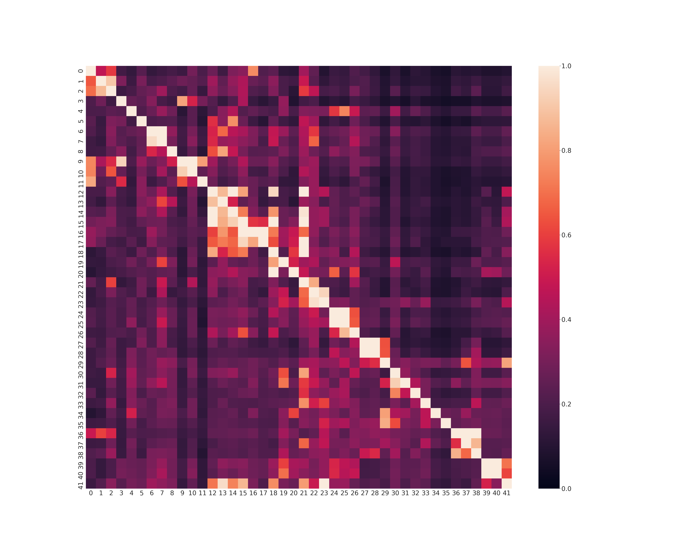
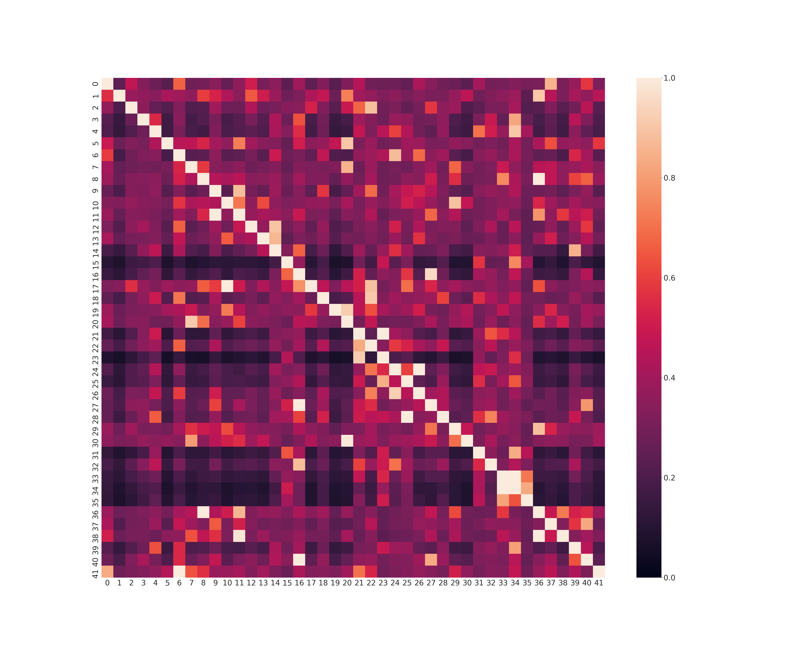

# unsupervised_sentence_representations

Unspervised creation of sentence representations using BERT's MLM head

[Medium article explaining this approach](https://towardsdatascience.com/unsupervised-creation-of-interpretable-sentence-representations-851e74921cf9)

# Installation

[for GPU machines](https://github.com/ajitrajasekharan/multi_gpu_test)

[For CPU machines follow instruction to install transformers](https://github.com/huggingface/transformers)

Clone this repository

./fetch_model.sh   

The above script will download bert-large-cased model as well as its vocab

python examine_model.py 2 > bert_vectors.txt

The python utility above will extract bert word vectors from the downloaded BERT model

# Example sentence representations

./run.sh 

The above script has example calls to generate sentence signatures, interactive and batch mode perform sentence similarity.

Batch mode invocation for two samples - short and long sentence data files, will generate numpy files that can be used to generate heatmaps.

Shown below are heatmaps for short and long sentence text.

# Comparison with USE, Sentence transformer and SBER=WK
Please refer to the links for the installation of these models. The test scripts to generate heatmaps for these models is present in the *compare* directory

# License

MIT License
